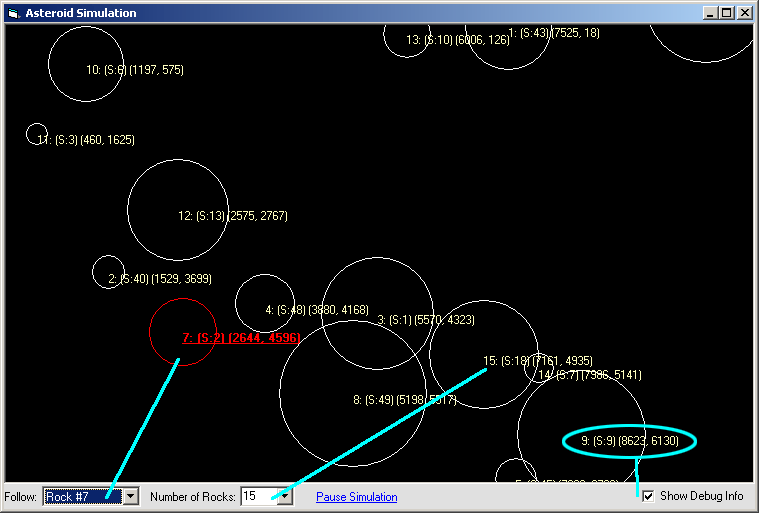



## Asteroid Simulation \(See ScreenShot\)

### Description

This is the very beginning of an Asteroid Clone. So far, you can select the # of asteroids to display, and there are a few debug options from the GUI. For now, this is all that there is, but it will eventually be a clone of the asteroids game. I figured it might be interesting to see the program grow. As it is now, the Rocks' Speeds, Slopes, sizes, etc.. are all randomly generated..but you can change that however you'd like.
 
### More Info
 

             |
---                |---
**Submitted On**   |2004-01-07 10:32:04
**By**             |[\[\]\)utch\[\]v\[\]aster](https://github.com/Planet-Source-Code/PSCIndex/blob/master/ByAuthor/utch-v-aster.md)
**Level**          |Beginner
**User Rating**    |4.3 (13 globes from 3 users)
**Compatibility**  |VB 5\.0, VB 6\.0
**Category**       |[Graphics](https://github.com/Planet-Source-Code/PSCIndex/blob/master/ByCategory/graphics__1-46.md)
**World**          |[Visual Basic](https://github.com/Planet-Source-Code/PSCIndex/blob/master/ByWorld/visual-basic.md)
**Archive File**   |[Asteroid\_S169122172004\.zip](https://github.com/Planet-Source-Code/utch-v-aster-asteroid-simulation-see-screenshot__1-50839/archive/master.zip)

